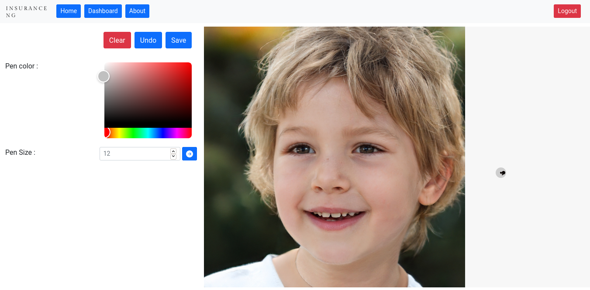

# Face Paint Template

Face paint is the new online free open-source tool to draw over images.
It's extremely easy to use, just make an account and get started.

Build for the purposes of [Mintbean](mintbean.io) hackathon.

## Table of Contents

1.  [Features](#features)
2.  [Setup](#setup)
    -   [Configurations](#configurations)
    -   [Development](#development)
3.  [Deployment](#deployment)

## Features

Face paint is the new online free open-source tool to draw over images, we have the following features:

1. Size and color Customization
Do not restrict yourself with a given color, use the entire RGB spectrum to find the perfect color and size your brush for the job.

2. Unlimited projects
Work on multiple projects at once, just upload the image and create a canvas for your project.

3. Free. Secure. Easy.
We do not sell your data, we do not charge you a dime. We just give you an easy to use online tool and let you design.

## Setup

The following section discusses how to setup Face paint in your system.

### Configurations

Create a copy of the `.env.example` file and rename it to `.env`. Now, we can manipulate the following variables to configure the application. You can find example values in the `.env.example` file itself.

| Key                          | Description                                                              |
| ---------------------------- | ------------------------------------------------------------------------ |
| DB_USER                      | PostgreSQL User                                                          |
| DB_PASS                      | PostgreSQL Password                                                      |
| DB_NAME                      | Database Table Name                                                      |
| DB_PORT                      | Database Port                                                            |
| DB_HOST                      | Database Host/Domain                                                     |
| DJANGO_SECRET_KEY            | Secret key used by Django as Salt                                        |
| DJANGO_ALLOWED_HOSTS         | Hosts allowed to make request to API                                     |
| DJANGO_CORS_ALLOWED_ORIGINS  | Whitelistesd Hosts for CORS                                              |
| REACT_APP_PORT               | Port on which react tries to find the application                        |
| DEBUG                        | Application Shows detailed logs when set to True                         |

### Prerequisites

- python
- pip
- mpm | yarn
- docker
- docker-compose

### Setup Steps

- Create a copy of the `.env.example` file and rename it to `.env`.
- Install react dependencies: `npm install`
- Install django dependencies: `pip install -r requirements.txt`
- Run the react application: `npm run react`
- Start dependent services: `npm run docker-dev`
- Prepare database: `npm run makemigrations; npm run migrate`
- On a different terminal, start server: `npm run server`

# Licenses

- The open-source libraries used have their own seperate licenses. Most of them are under MIT license. Please check the license for [python dependencies' licenses](./requirements.txt) and [react dependencies' licenses](./package.json) before using the project for your purposes.
